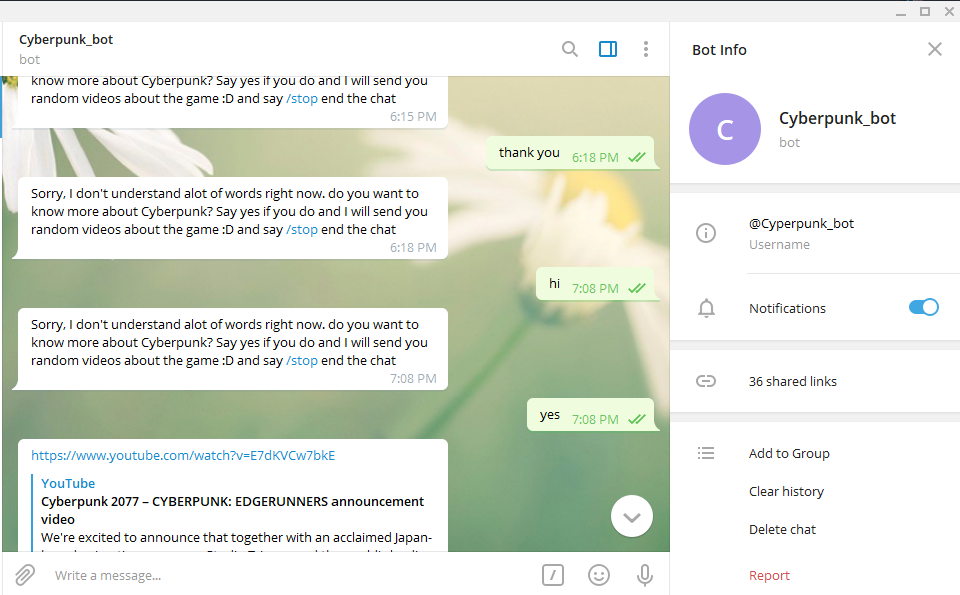

# Cyberpunk Telegram Bot

> This is a Telegram Bot Project for Ruby learners.

This bot shares with you random videos about Cyberpunk game.



## Built With

- Ruby
- Telegram API
- Ruby Gems
- Telegram-ruby-bot Gem

## Video Explanation

Here is the [video explanation](https://www.loom.com/share/c6738ee94321498bacc9f3c6eb38448e) of this project.

## Prerequisities

To get this project up and running locally, you must already have ruby and necessary gems installed on your computer.

### Installation

**Step 1**

Navigate through the local folder where you want to clone the repository and run:

```bash
git clone https://github.com/mohapakram/Cyperpunk_telegram_bot.git
```

It will clone the repo to your local folder.

**Step 2**

Navigate to the cloned local project folde.

```bash
cd ruby_slack_bot
```

**Step 3**

Install the necesary gems.

```bash
bundle install
```

**Step 4**

Head to [Telegram bot API](https://core.telegram.org/bots#3-how-do-i-create-a-bot) to create a bot and get an `authorization token`.

**Step5**

Copy your TOKEN to the .env file in the root of the project and paste it here:

```bash
#.env
TOKEN= your-token-here
```

**Step 6**

Start the bot by running

```bash
$ ruby ./bin/main.rb
```

You should see this output

```bash
$ ruby ./bin/main.rb
Bot is running ...
```

And now the bot is running successfully.

## Talking to the bot from Telegram

Open Telegram and search for `Cyberpunk_bot`.

- You can type `/start` to start the conversation.

- The bot will ask you if you want to know more about the game.

- Type `yes` and it will send you a random video, keep replying with `next` for more videos.

- you can type `/end` to end the conversation.

## Authors

:bust_in_silhouette: **Mohab Akram**

- Github: [@mohabakram](https://github.com/mohapakram)
- Twitter: [@mohabakram](https://twitter.com/mohapakram)
- LinkedIn: [@Mohab Akram](https://www.linkedin.com/in/mohab-akram-667093131/)

## :handshake: Contributing

## Show your support

If you've read this far, you must like the project! Give me a :star:️!

## Acknowledgments

- Our thanks to Microverse and all our peers and colleagues there.

## :memo: License

This project has no license
